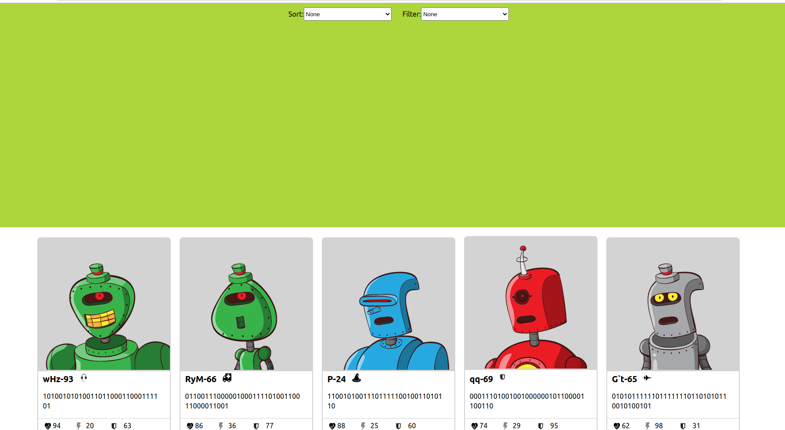

# Bot Battlr

Welcome to Bot Battlr, a React web application where users can browse through a list of robots, view each robot's details, and enlist bots into their personal army.



## Table of Contents

- [Features](#features)
- [Installation](#installation)
- [Usage](#usage)
- [Advanced Features](#advanced-features)
- [Contributing](#contributing)
- [Author](#author)
- [License](#license)

## Features

- Browse a collection of bots.
- View individual bot details.
- Enlist bots into a personalized army.
- Release bots from the user's army.
- Delete bots permanently.

## Installation

1. Clone the repository:

\```
git clone https://github.com/gich2009/phase-2-code-challenge-bot-battlr.git
\```

2. Navigate to the project directory:

\```
cd phase-2-code-challenge-bot-battlr
\```

3. Install dependencies:

\```
npm install
\```

4. Start the development server:

\```
npm run server
\```

5. Start the application:

\```
npm start
\```

The application will be available at `http://localhost:6002` and the backend will be running on `http://localhost:6001`.

## Usage

- Browse through the list of available bots in the BotCollection.
- Click on a bot to enlist it in your personal army, which will be displayed in the YourBotArmy component.
- Click on a bot in your army to release it, removing it from the YourBotArmy component.
- Click the red "x" button to delete a bot permanently, removing it from both the backend and YourBotArmy.

## Advanced Features

- Click on a bot to display its detailed information (BotSpecs) and enlist or return to the list view.
- Sort bots by health, damage, or armor using the SortBar component.
- Filter bots by class.
- Enlist only one bot from each bot_class.

## Contributing

1. Fork the repository and create your branch from `main`.
2. Install dependencies with `npm install`.
3. Make your changes and test them.
4. Commit your changes and push to your fork.
5. Open a pull request to the `main` branch.

Please ensure your code follows best practices and is well-documented.

## Author

**Amos Wanene** - [gich2009](https://github.com/gich2009)

## License

This project is licensed under the MIT License - see the [LICENSE.md](LICENSE.md) file for details.
